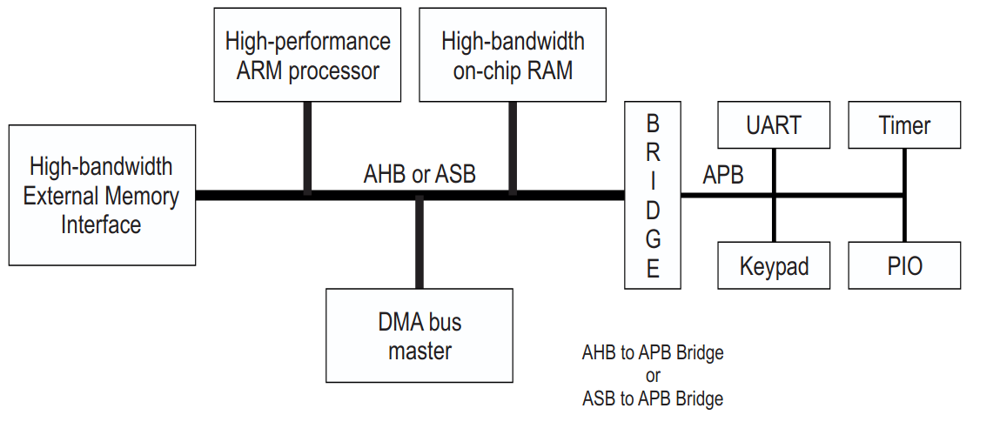

# AMBA
## Giới thiệu về AMBA

AMBA là viết tắt của Advanced Microcontroller Bus Architecture (Kiến trúc Bus cho Vi điều khiển Nâng cao). Đây là một bộ đặc tả giao thức do Arm định nghĩa. 
AMBA xác định một tiêu chuẩn truyền thông trên chip nhằm mục đích thiết kế vi điều khiển nhúng hiệu năng cao. 

AMBA cung cấp các giải pháp để kết nối và quản lý các khối chức năng tạo nên một Hệ thống trên chip (SoC). Các ứng dụng của AMBA bao gồm việc phát triển các hệ thống nhúng với một hoặc nhiều bộ xử lý (CPU) hoặc bộ xử lý tín hiệu và nhiều thiết bị ngoại vi.

Một trong những mục tiêu của đặc tả AMBA là để độc lập với công nghệ, đảm bảo các macrocell ngoại vi và hệ thống có thể được tái sử dụng cao và di chuyển trên nhiều quy trình công nghệ IC khác nhau. Đặc tả chỉ chi tiết giao thức bus ở cấp độ chu kỳ xung nhịp, không bao gồm các đặc tính điện.

Trong phiên bản Đặc tả AMBA (Rev 2.0), AMBA định nghĩa ba loại bus riêng biệt:

- Advanced High-performance Bus (AHB): AHB được thiết kế cho các module hệ thống hiệu năng cao, tần số xung nhịp cao
- Advanced System Bus (ASB): ASB là thế hệ đầu tiên của bus hệ thống AMBA, hỗ trợ hoạt động pipeline và nhiều master bus
- Advanced Peripheral Bus (APB): APB được tối ưu hóa cho tiêu thụ điện năng tối thiểu và giảm độ phức tạp giao diện. APB thường hoạt động như một bus thứ cấp cục bộ, được đóng gói như một thiết bị slave AHB hoặc ASB duy nhất.

## Một vi điều khiển điển hình dựa trên AMBA

Hình bên dưới mô tả cấu trúc hệ thống bus của một vi điều kiển điển hình dựa trên AMBA.

Trong đó:

-   High-performance ARM processor: Bộ xử lý ARM hiệu năng cao, được kết nối trực tiếp với bus hệ thống hiệu năng cao 
-   High-bandwidth on-chip RAM: Bộ nhớ RAM tích hợp trên chip băng thông cao, là khối bộ nhớ nằm trên cùng một chip với bộ xử lý và các thành phần khác của hệ thống AMBA điển hình.
-   High-bandwidth External Memory Interface: Giao diện bộ nhớ ngoài băng thông cao, là một khối chức năng trong hệ thống AMBA được sử dụng để kết nối các thành phần trên chip với bộ nhớ vật lý nằm ngoài chip.
-   DMA (**D**irect **M**emory **A**ccess) bus master:

Bộ xử lý tốc độ cao, on-chip RAM, off-chip RAM, DMA bus master được kết nối sử dụng giao thức tốc độ cao AHB/ASB. Trong khi đó các ngoại vi được kết nối thông qua giao thức tốc độ thấp hơn và kết nối với bus tốc độ cao thông qua cầu AHBP2APB hoặc APB2AHB.

## Thuật ngữ

Một số thuật ngữ được dùng trong AMBA:

<table>
    <tr>
        <td>
            Thuật ngữ 
        </td>
        <td>
            Ý nghĩa
        </td>
        <td>
            Giải thích 
        </td>
    </tr>
    <tr>
        <td>
            Bus cycle
        </td>
        <td>
            Chu kỳ bus
        </td>
        <td>
            Một chu kỳ bus là đơn vị cơ bản của một chu kỳ xung nhịp bus và đối với mục đích mô tả giao thức AMBA AHB hoặc APB, nó được định nghĩa từ posedge --> negedge.
        </td>
    </tr>
    <tr>
        <td>
            Bus transfer
        </td>
        <td>
            Truyền bus
        </td>
        <td>
            Truyền bus (Bus transfer) Một truyền bus AMBA ASB hoặc AHB là một hoạt động đọc hoặc ghi dữ liệu, có thể mất một hoặc nhiều chu kỳ bus. Truyền bus được kết thúc bằng phản hồi hoàn thành từ slave được chỉ định. Các kích thước truyền được hỗ trợ bởi AMBA ASB bao gồm byte (8-bit), halfword (16-bit) và word (32-bit). AMBA AHB hỗ trợ thêm các truyền dữ liệu rộng hơn, bao gồm truyền 64-bit và 128-bit. Một truyền bus AMBA APB là một hoạt động đọc hoặc ghi dữ liệu, luôn luôn yêu cầu hai chu kỳ bus.
        </td>
    </tr>
    <tr>
        <td>
            Burst operation
        </td>
        <td>
            Hoạt động truyền liên tục
        </td>
        <td>
            Được định nghĩa là một hoặc nhiều giao dịch dữ liệu, được khởi tạo bởi một bus master, có độ rộng giao dịch nhất quán tới một vùng địa chỉ tăng dần. Bước tăng dần cho mỗi giao dịch được xác định bởi độ rộng của truyền (byte, halfword, word). APB không hỗ trợ truyền liên tục.
        </td>
    </tr>
</table>

# Qui cách đặt tên tín hiệu AMBA

Bảng bên dưới mô tả cách các tín hiệu được đặt tên.

<table>
    <tr>
        <td>
            Loại AMBA
        </td>
        <td>
            Đặc diểm
        </td>
        <td>
            Giải thích
        </td>
        <td>
            Ví dụ
        </td>
    </tr>
    <tr>
        <td>
            AMBA
        </td>
        <td>
            Tiền tố (prefix) định nghĩa loại bus
        </td>
        <td>
            --
        </td>
        <td>
            --
        </td>
    </tr>
    <tr>
        <td>
            AMBA
        </td>
        <td>
            Ký tự <code>n</code>
        </td>
        <td>
            Chỉ ra đây là tín hiệu tích mực mức thấp.
        </td>
        <td>
            <code>BnRES</code>
        </td>
    </tr>
    <tr>
        <td>
            AHB
        </td>
        <td>
            prefix:<code>H</code>
        </td>
        <td>
            Là một tính hiệu AHB
        </td>
        <td>
            <code>HREADY</code> là tín hiệu báo quá trình truyền dữ liệu hoàn tất, tín hiệu tích cực mức cao.
        </td>
    </tr>
    <tr>
        <td>
            ASB
        </td>
        <td>
            Prefix: <code>A</code>
        </td>
        <td>
            là một tín hiệu đơn hướng giữa các bus master ASB và bộ điều phối (arbiter).
        </td>
        <td>
            --
        </td>
    </tr>
    <tr>
        <td>
            ASB
        </td>
        <td>
            Prefix: <code>B</code>
        </td>
        <td>
            Là tín hiệu ASB.
        </td>
        <td>
            <code>BnRES</code> là tín hiệu ASB reset, tích cực mức thấp.
        </td>
    </tr>
    <tr>
        <td>
            ASB
        </td>
        <td>
            Prefix: <code>D</code>
        </td>
        <td>
        </td>
            Tín hiệu giải mã (decoder) của ASB.
        <td>
            --
        </td>
    </tr>
    <tr>
        <td>
            APB
        </td>
        <td>
            Prefix: <code>P</code>
        </td>
        <td>
            Tín hiệu APB. 
        </td>
        <td>
            <code>PCLK</code> - tín hiệu CLK sử dụng bởi APB.
        </td>
    </tr>
</table>